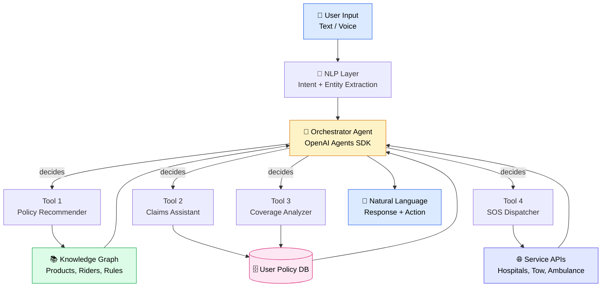
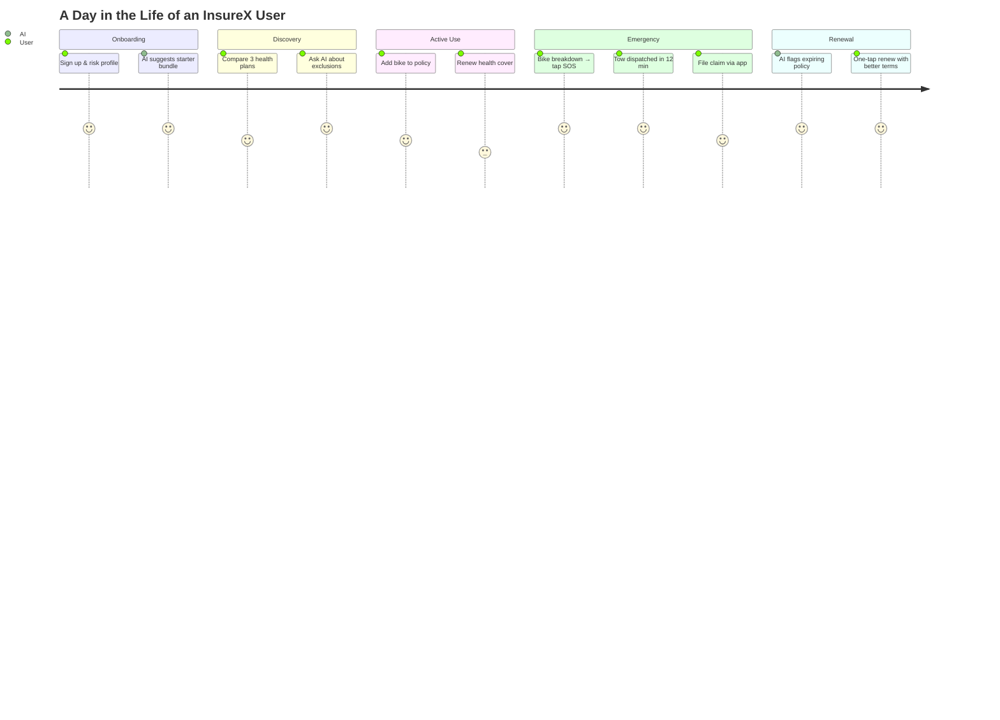

<div align="center">

# 🛡️ InsureX

### *Insurance. Reinvented with Intelligence.*

**Reimagining insurance as a proactive AI companion — not a reactive paperwork nightmare.**

<br/>

[](https://insurex-ai-insurance-ruwe.bolt.host/)
[](https://bolt.new)
[](https://www.ecelliitg.com)
[]()
[]()

<br/>

> *"What if insurance became proactive instead of reactive?"*
> — That single question built this entire product.

<br/>

[🌐 Live Demo](https://insurex-ai-insurance-ruwe.bolt.host/) · [📖 The Story](#-the-vision) · [✨ Features](#-whats-inside) · [🧠 AI Architecture](#-ai-architecture) · [🛠️ Setup](#-setup) · [🗺️ Roadmap](#-roadmap)

</div>

---

## 🌍 The Reality (The Problem)

Most people interact with insurance only **four times** in their life — and each one is painful.

| 😩 The Pain | 💥 What it Costs You |
|---|---|
| Policies are written in **legalese** you can't decode | You buy cover you don't need, miss cover you do |
| Comparing 12 insurers means **12 spreadsheets** | Decision fatigue → bad choice or no choice |
| Claims feel like **a black box** | Anxiety, endless follow-ups, sometimes fraud suspicion |
| Renewals **sneak up** on you | Lapsed policies, lost continuity, no coverage when needed |
| The insurer only calls when **they want money** | Zero engagement, zero trust, zero loyalty |

> 📉 The result: insurance is the **#1 most-hated** financial product globally — not because the product is bad, but because the *experience* is broken.

---

## 💡 The Vision (Our Bet)

**InsureX** flips the script. Insurance shouldn't *wait* for you to figure it out. It should **know** your life stage, **anticipate** your needs, **guide** you through claims, and **show up** in emergencies.

> 🎯 **One line:** *An AI companion that lives with you across the full insurance lifecycle — from discovery to claims to renewal.*

This isn't a chatbot bolted onto an insurer's website. This is a **re-architecture of the relationship** between humans and insurance.

---

## ✨ What's Inside

### 🤖 1. AI Copilot
A conversational assistant that **understands plain English** and takes action.
- *"I'm turning 30 next year and just got married — what do I need?"*
- *"File a claim for my car — here's the FIR number."*
- It picks the right tool, fills the right form, and confirms before doing anything.

### 🎯 2. Life Stage Intelligence
Insurance that **grows with you**, not against you.
- 🧑 *Single, 24* → health + term cover focus
- 💍 *Married, 28* → joint health + life cover
- 👶 *New parent, 32* → child education + family floater upgrade
- 🏠 *Home loan, 38* → property + mortgage cover
- The platform **re-asks your risk profile** periodically and surfaces gaps.

### 📂 3. Unified Policy Wallet
Every policy, every insurer, **one inbox**.
- Auto-parses policy PDFs → extracts coverage, premium, renewal date
- Color-coded by **status** (active, expiring soon, lapsed)
- One-tap access to insurer, sum insured, exclusions, claim history

### 🛡️ 4. Digital Claims & Real-time Tracking
No more *"sir, please hold."*
- File a claim in **under 90 seconds** via guided flow
- Track status in real-time (Submitted → In Review → Survey → Approved → Disbursed)
- Auto-attaches required docs (FIR, photos, bills) via camera upload
- AI pre-validates your claim before submission to maximize approval odds

### 🚨 5. Emergency SOS Support
**One tap. Instant help.** Lives in the home screen.
- 🚑 Ambulance dispatch with live ETA
- 🔧 Roadside assistance (tow, fuel, flat)
- 🏥 Nearest hospital / network garage locator
- 📞 Direct line to your claim officer (no IVR hell)

### 📊 6. Coverage Health Score & Trust Dashboard
**Gamify protection.** Make insurance *visible*.
- A 0–100 score showing how well-covered you are (and where the gaps are)
- Trendlines over time — are you getting more or less protected?
- **Trust score** for each insurer based on claim settlement ratio + your history
- Yearly "Insurance Health Report" you can actually understand

### 🌐 7. Integrated Service Ecosystem
InsureX is a **platform**, not a portal.
- 🩺 **Telemedicine** consultations (cashless, in-app)
- 🚗 **Roadside assistance** (24×7, pan-India)
- ✈️ **Travel support** (visa, forex, insurance)
- 🧘 **Wellness services** (mental health, fitness, nutrition)

---

## 🧠 AI Architecture

How does InsureX actually *think*?

<div align="center">



</div>

### 🧩 The 4 Layers

| Layer | What it does | Tech |
|---|---|---|
| **1. Perception** | Reads text/voice, extracts intent + entities | NLP, embeddings |
| **2. Reasoning** | Decides which tool to call, in what order | LLM-based agent |
| **3. Action** | Calls the right API (policy, claim, SOS) | Tool routing |
| **4. Memory** | Remembers user profile, history, preferences | Vector DB + KG |

---

## 🗺️ User Journey

What does it actually feel like to use InsureX?



---

## 🎯 Product Strategy (PM Lens)

Built as a **Product Management capstone**, not just a tech demo. Here's the framework:

| Dimension | Approach |
|---|---|
| 👥 **User Needs** | Mapped pain across discovery, claims, renewal, emergencies |
| 💼 **Business Goals** | Increased engagement, lower churn, higher cross-sell |
| 🤖 **AI Innovation** | Proactive nudges instead of reactive forms |
| 🎨 **Design** | Conversational UI, zero-jargon, mobile-first |
| 📈 **Metrics Tracked** | Coverage Health Score, Claim NPS, Renewal Rate |

> 📝 *"More than building a prototype, this project helped me think like a PM — balancing user needs, business objectives, AI-driven innovation, and intuitive design to solve a real-world challenge."*

---

## 🛠️ Built With

| Layer | Tech |
|---|---|
| 🎨 **Frontend** | React + TypeScript + Tailwind CSS |
| ⚡ **App Builder** | [bolt.new](https://bolt.new) — AI-powered full-stack prototyping |
| 🧠 **AI Layer** | LLM-based agent orchestration + tool routing |
| 💾 **Data** | User profile, policy records, knowledge graph |
| 🚀 **Deployment** | bolt.new hosting (live URL) |

> *Drop your exact tech stack in here — e.g. Supabase, OpenAI, etc. — for full transparency.*

---

## 🚀 Setup

### Prerequisites
- [Node.js](https://nodejs.org/) v18+
- npm or pnpm

### Local install

```bash
# 1. Clone
git clone https://github.com/NishantDas0079/InsureX.git
cd InsureX

# 2. Install deps
npm install

# 3. Env vars
cp .env.example .env.local
# → fill in your API keys

# 4. Run
npm run dev
```

Open the local URL it prints (usually `http://localhost:5173`).

---

## 📂 Project Structure

```
insurex/
├── 📁 src/
│   ├── 🧩 components/    # Reusable UI components
│   ├── 🤖 ai/             # AI agent, tools, prompts
│   ├── 📄 pages/          # Route-level views
│   ├── 🎨 styles/         # Tailwind + theme config
│   └── 🛠️ utils/          # Helpers, hooks, services
├── 📁 public/             # Static assets
├── 🔐 .env.local          # API keys (gitignored)
├── 📦 package.json
└── 📖 README.md           # You are here
```

---

## 🎓 Capstone Credits

This project was built as part of:

<div align="center">

| | |
|---|---|
| 🏆 **Program** | **Product Matters 6.0** — IIT Guwahati's flagship PM case-study competition |
| 🏛️ **Host** | **E-Cell, IIT Guwahati** |
| 🏢 **Industry Partner** | **IndusInd General Insurance** |
| 👤 **Built by** | **[Nishant Das](https://github.com/NishantDas0079)** |

</div>

> 🙏 Massive thanks to E-Cell IITG and IndusInd General Insurance for the mentorship, the brief, and the real-world challenge.

---

## 🗺️ Roadmap

What's next for InsureX:

- [ ] 🔗 **Direct insurer API integrations** (instead of policy PDF parsing)
- [ ] 🪙 **Premium optimization engine** — find cheaper equivalent cover
- [ ] 👨‍👩‍👧 **Family mode** — manage policies for parents, spouse, kids
- [ ] 📲 **WhatsApp copilot** — chat with your insurance on the app you already use
- [ ] 🧾 **Tax planning** — surface 80C / 80D deductions automatically
- [ ] 🌍 **Multi-lingual support** — Hindi, Tamil, Bengali, more
- [ ] 🤝 **Insurer partnerships** — cashless network expansion

---

## 🤝 Contributing

This started as a capstone, but it doesn't have to end there. PRs, issues, and ideas are all welcome.

```bash
# Fork → branch → PR
git checkout -b feat/your-feature
git commit -m "feat: add your feature"
git push origin feat/your-feature
```

Open an [issue](https://github.com/NishantDas0079/InsureX/issues) if you want to discuss before building.

---

## 📄 License

Currently unlicensed — add MIT / Apache 2.0 if you decide to open-source. *(For a capstone prototype, the choice is yours.)*

---

## 👤 About the Author

<div align="center">

**Nishant Das**

*Product Manager in the making, builder by night.*

[](https://github.com/NishantDas0079)
[](https://insurex-ai-insurance-ruwe.bolt.host/)

*If InsureX made you rethink insurance, ⭐ the repo — it means a lot.*

</div>
